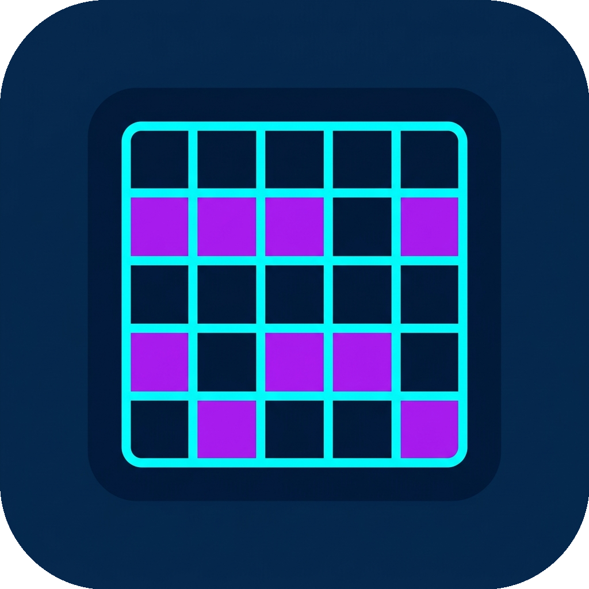

#  Rustle

[](https://github.com/dachoras/rustle/actions/workflows/ci.yml)

Word guessing arcade game.

## Quick Start

### Self-Hosting (Docker)
Pull and run the official Docker container:
```bash
docker run -d -p 4502:4502 ghcr.io/dachoras/rustle:latest
```
